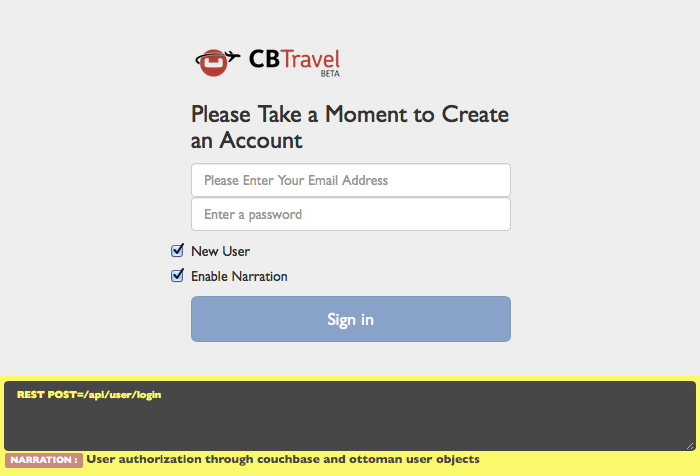

# Travel Sample Application

Couchbase Travel is a sample web application that demonstrates how to interact with the Couchbase query services via the SDKs.

Each SDK comes with its own implementation of the backend for the application. You can download the complete source code and then build and run the app. While the app runs, you can get a peek of what is happening in the backend via the "Narration (a console like UI element that can display N1QL queries for instance). It is only visible in components that communicate with the server (but can also be collapsed).


The documentation for the travel app illustrates the data model and walks through the N1QL and FTS queries used to select flights and search for hotels.

## Prerequisites

You'll need:

- Git
- Apache Maven
- A local Couchbase 4.5 (or greater) installation. (Make sure that the travel-sample bucket has been loaded from 4.5 and that there is, at least, one node with data, query, index and full text search services in the cluster.)
- That's it!

Installing Git and Maven is outside the scope of this document. For example, on Linux you could use your distribution's package manager to install them.

To start, it is easiest if you run Couchbase Server and the travel sample app on the same machine. You don't need to run your development environment this way, and advanced MDS configurations are supported. It's just easier to start a development environment with components running locally.

Download [Couchbase Server 5.0.1 Community](https://www.couchbase.com/downloads) and install it. As you follow the download instructions and setup wizard, make sure you keep all the services (`data`, `query`, and `index`) selected. Make sure also to install the sample bucket named `travel-sample` (introduced in Couchbase Server 4.0) because it contains the data used in this tutorial.


If you already have Couchbase Server 4.5 or later installed but did not install the `travel-sample` bucket (or you installed it from a 4.0 version), open the Couchbase Web Console and select **Settings > Sample Buckets**. Select the `travel-sample` checkbox, and then click Create. A notification box in the upper-right corner disappears when the bucket is ready to use.

Finally, in order to be able to search for `hotels`, an FTS index called hotels must be created on the travel-sample bucket. Go to `Indexes > Full Text > New Full Text Index` and create the hotels index.


Note that the index mapping could be better tuned, but a generic mapping will also work fine for this example.

## Using the Travel App

Before running the application, make sure that the Couchbase Server instance is running. If you are using Couchbase server

### Installation

```bash
$ git clone https://github.com/couchbaselabs/try-cb-java.git
$ cd try-cb-java
$ git checkout 5.0-updates
$ mvn spring-boot:run
```

Open `127.0.0.1:8080` in your browser.

To find a flight:

1. Open a browser and navigate to the login URL that was displayed when you started the app.

2. Sign in to Couchbase Travel by providing your credentials, or create a new account (which will expire after some time depending on the backend used, usually 1 hour).

	

3. Find a flight:


In the Airport or City section, enter an airport code or city name in the From and To fields. In the Travel Dates section, enter Leave and Return dates in MM/DD/YYYY format. Click Find Flights. The app displays the available flights for the outbound and return legs of the trip. Select one or more flights to add to your cart by clicking the choose button next to each flight.


Now you have flights stored locally in your cart. Go to the cart page and review your flights:

1. Click on the cart icon button in the navigation bar, top right
2. See that the number of flights in the cart and the total cost are displayed in said navigation bar.
3. Review the flights in your cart, and book one by clicking on the book button next to it.


4. The flight is now booked, as confirmed by a message on the page.

The flights that you've booked are stored in the backend. You can see which flights you've booked by navigating to the "user" page. The backend uses authentication to control access to the endpoints for booking and listing flights.


To search for an hotel, navigate to the hotel page:

Click on the "earth" icon in the navigation bar (rightmost icon). Click on the Find Hotels button if you want to have a look at any first 100 hotels. Refine your search using the input boxes, either by keyword, geographically or both.


> Warning: You should make sure that you have installed Couchbase 4.5 with FTS enabled. The API backend that is used by the hotels page makes use of an FTS index that you have to create, named hotels.

## Using Couchbase Browser and Command Line Tools

You can browse and access documents in Couchbase using browser and command line tools without writing any code. This can be helpful to you if you simply wish to inspect cluster data without writing code. You can access individual documents using the command line and web console.

### Using the command-line query shell (cbq)

You can use the cbq program as a command line query shell to issue N1QL queries in couchbase. cbq is available on all cluster nodes and does not require a separate installation. Simply run cbq from the Couchbase installation directory. (The program is located in **/opt/couchbase/bin** on Linux, **C:\Program Files\Couchbase Server\bin** on Windows and **/Applications/Couchbase Server.app/Contents/Resources/couchbase-core/bin** on macOS.) When the shell is running, a prompt is displayed, ready for you to issue any N1QL query.

```bash
$ ./cbq -e http://localhost:8091 -u=Administrator -p=password
cbq> select airportname FROM `travel-sample` WHERE airportname IS NOT NULL LIMIT 1;
{
    "requestID": "163ad4b2-a81f-472d-a4a7-83ea70172f3d",
    "signature": {
        "airportname": "json"
    },
    "results": [
        {
            "airportname": "Abbeville"
        }
    ],
    "status": "success",
    "metrics": {
        "elapsedTime": "35.741626ms",
        "executionTime": "35.688028ms",
        "resultCount": 1,
        "resultSize": 50
    }
}
cbq> \exit;
```

For more information on cbq commands, see the [cbq documentation](https://developer.couchbase.com/documentation/server/current/tools/cbq-shell.html).

### Web Console Document Access

You can use the Web Console to view, edit, and create JSON documents up to 2.5KB in size. To access documents using the Web Console:

1. Navigate your browser to a cluster node. Type the address of the cluster with the admin port (8091). Use your username (usually Administrator). The password is the password you used when setting up the cluster.

2. Once logged in, click on **Buckets** to go to the Buckets section.

	

3. Click on the **Documents** button link to the right of the `travel-sample` bucket.

	

4. To retrieve a document, type in the document ID and click on **Look Up ID**. The document edit page is displayed.

	

	

5. To create a new document, return to the Documents section and click on **Add Document**.

	

6. When prompted, enter a document ID.

	

7. Once created, you can edit your document. Don't forget to click on **Save** when done.

	
