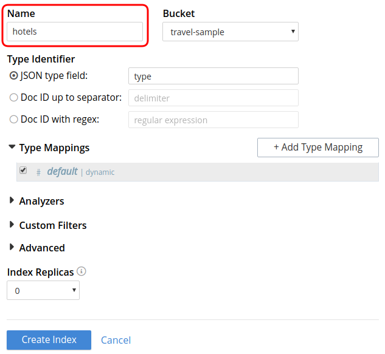
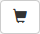
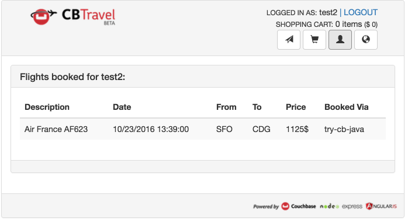

# Travel Sample Application

Couchbase Travel is a sample web application that demonstrates how to interact with the Couchbase query services via the SDKs.

Each SDK comes with its own implementation of the backend for the application. You can download the complete source code and then build and run the app.

The documentation for the travel app illustrates the data model and walks through the N1QL and full text search (FTS) queries used to select flights and search for hotels.

## Before You Begin

You'll need:

- [Git](https://git-scm.com/)
- [Apache Maven](https://maven.apache.org/)
- A local Couchbase 5.0 (or later) installation. (Make sure that the `travel-sample` bucket has been loaded, and that there is at least one node with data, query, index and full text search services in the cluster.)
- That's it!

Installing Git and Maven depends on your operating system and is outside the scope of this document. For example, on Linux you could use your distribution's package manager to install them.

This section describes how to install Couchbase Server and the Couchbase Travel app on the same computer. You don't need to run your development environment this way, and advanced MDS configurations are supported. It's just easier to start a development environment with components running locally.

1. Download [Couchbase Server 5.0.1 Community](https://www.couchbase.com/downloads) and install it. When installed, open a browser and navigate to the Couchbase Web Console URL -- by default, `127.0.0.1:8091`. When prompted, create a new cluster. Make sure all the services (**Data Service**, **Index Service**, **Search Service** and **Query Service**) are selected.

	

2. If you have not installed the `travel-sample` bucket, or you installed it from an earlier version, select **Settings > Sample Buckets**. Select the **travel-sample** checkbox, and then click on **Load Sample Data**. When the bucket is ready to use, it is listed under the **Installed Samples** heading.

	

3. Finally, in order to be able to search for hotels, you must create an FTS index on the `travel-sample` bucket. Select **Search > Add Index** and create an index named **hotels**.

	

> Note: The index mapping could be better tuned, but a generic mapping will also work fine for this example.

## Using Couchbase Travel

Before running the application, make sure that the Couchbase Server instance is running.

### Installing and Launching

You can install Couchbase Travel using Git. To use the application with Couchbase Server 5.0 or later, you need to check out the `5.0-updates` branch. When launching Couchbase Travel with Apache Maven, specify the Administrator username and password for your local installation of Couchbase Server -- by default, `Administrator` and `password`.

```bash
$ git clone https://github.com/couchbaselabs/try-cb-java.git
$ cd try-cb-java
$ git checkout 5.0-updates
$ mvn spring-boot:run -Dstorage.host=127.0.0.1 -Dstorage.bucket=travel-sample -Dstorage.password=password -Dstorage.username=Administrator
```

### Working with the Travel App

While the app runs, you can get a peek of what is happening in the backend via the Narration -- a console-like UI element that can display N1QL queries, for instance. It is only visible in components that communicate with the server. You can collapse it if required.


To find and book a flight:

1. Open a browser and navigate to the Couchbase Travel URL -- by default, `127.0.0.1:8080`.

2. Sign in to Couchbase Travel by creating a new account, or providing existing credentials. (New accounts expire after some time depending on the backend used, usually 1 hour.)

	

3. In the **Airport or City** section, enter an airport code or city name in the **From** and **To** fields. In the **Travel Dates** section, enter **Leave** and **Return** dates in MM/DD/YYYY format.

	

4. Click on **Find Flights**. The app displays the available flights for the outbound and return legs of the trip.

5. Select one or more flights to add to your cart by clicking on the **Choose** button next to each flight.

	

Now you have flights stored locally in your cart. You can see that the number of flights in the cart and the total cost are displayed in the navigation bar at the top right. To review your flights, navigate to the cart page:

1. Click on the cart button in the navigation bar. 

2. Review the flights in your cart, and book one by clicking on the **Book** button next to it.

	

The flight is now booked, as confirmed by a message on the page.

The flights that you've booked are stored in the backend. The backend uses authentication to control access to the endpoints for booking and listing flights.

To see which flights you've booked, navigate to the user page:

1. Click on the user button in the navigation bar. 

	

To search for an hotel, navigate to the hotel page:

1. Click on the hotel button on the right of the navigation bar. 

2. Don't enter any search criteria yet. Just click on the **Find Hotels** button. The first 100 hotels are displayed.

3. Now enter a keyword in the **Description** box, or a location in the **Location** box, and click on **Find Hotels** again to refine your search.

	

> Important: To use the hotel search, you must have created an FTS index named `hotels`, as described earlier. The API backend that is used by the hotel page makes use of this FTS index.

## Using Couchbase Browser and Command Line Tools

You can browse and access documents in Couchbase using browser and command line tools without writing any code. This can be helpful to you if you simply wish to inspect cluster data without writing code. You can access individual documents using the command line and web console.

### Using the command-line query shell (cbq)

You can use the cbq program as a command line query shell to issue N1QL queries in couchbase. cbq is available on all cluster nodes and does not require a separate installation. Simply run cbq from the Couchbase installation directory. (The program is located in **/opt/couchbase/bin** on Linux, **C:\Program Files\Couchbase Server\bin** on Windows and **/Applications/Couchbase Server.app/Contents/Resources/couchbase-core/bin** on macOS.) When the shell is running, a prompt is displayed, ready for you to issue any N1QL query.

```bash
$ ./cbq -e http://localhost:8091 -u=Administrator -p=password
cbq> select airportname FROM `travel-sample` WHERE airportname IS NOT NULL LIMIT 1;
{
    "requestID": "163ad4b2-a81f-472d-a4a7-83ea70172f3d",
    "signature": {
        "airportname": "json"
    },
    "results": [
        {
            "airportname": "Abbeville"
        }
    ],
    "status": "success",
    "metrics": {
        "elapsedTime": "35.741626ms",
        "executionTime": "35.688028ms",
        "resultCount": 1,
        "resultSize": 50
    }
}
cbq> \exit;
```

For more information on cbq commands, see the [cbq documentation](https://developer.couchbase.com/documentation/server/current/tools/cbq-shell.html).

### Web Console Document Access

You can use the Web Console to view, edit, and create JSON documents up to 2.5KB in size. To access documents using the Web Console:

1. Navigate your browser to a cluster node. Type the address of the cluster with the admin port (8091). Use your username (usually Administrator). The password is the password you used when setting up the cluster.

2. Once logged in, click on **Buckets** to go to the Buckets section.

	

3. Click on the **Documents** button link to the right of the `travel-sample` bucket.

	

4. To retrieve a document, type in the document ID and click on **Look Up ID**. The document edit page is displayed.

	

	

5. To create a new document, return to the Documents section and click on **Add Document**.

	

6. When prompted, enter a document ID.

	

7. Once created, you can edit your document. Don't forget to click on **Save** when done.

	
